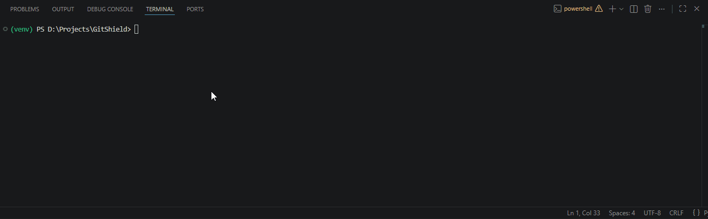
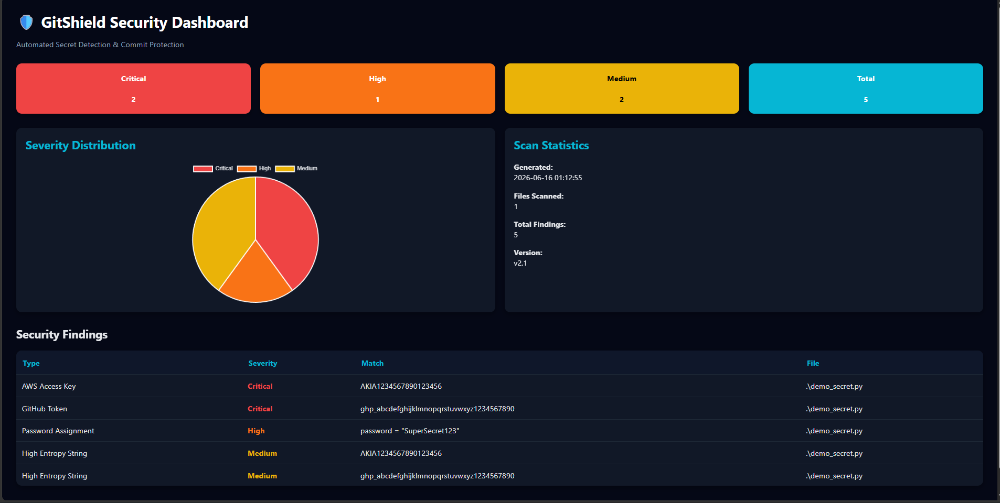
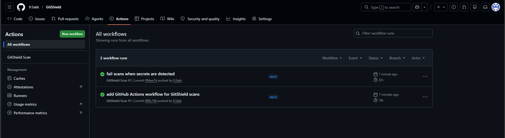

# GitShield

🛡️ A Python-based DevSecOps security tool that detects exposed secrets before they reach your Git repository.

GitShield combines regex-based secret detection, entropy analysis, Git pre-commit protection, interactive security dashboards, and GitHub Actions integration to prevent accidental credential leaks throughout the development lifecycle.

---

## 🎬 Demo



GitShield automatically blocks commits containing exposed credentials before they enter version control.

---

## ✨ Features

* Regex-based secret detection
* Entropy-based secret detection
* Severity classification (Critical / High / Medium)
* Git pre-commit hook protection
* Automatic commit blocking
* Staged-file scanning
* Interactive HTML security dashboard
* JSON reporting
* Secret masking in reports
* Finding deduplication
* GitHub Actions CI/CD integration
* Configurable detection rules

---

## 🏗️ Architecture

```text
Developer
    ↓
git add
    ↓
GitShield Pre-Commit Hook
    ↓
Regex Detection
      +
Entropy Detection
    ↓
Findings
    ↓
Allow / Block Commit
    ↓
Push to GitHub
    ↓
GitHub Actions Scan
    ↓
PASS / FAIL
```

---

## 🚫 Commit Protection

When secrets are detected:

```text
[!] GITSHIELD BLOCKED COMMIT

Detected 1 potential secret:

[Critical] AWS Access Key -> secret.py
```

The commit is automatically blocked until the secret is removed.

---

## 📊 Security Dashboard

### Interactive HTML Report



Features:

* Severity distribution visualization
* Scan statistics
* Security findings table
* Professional dark-themed dashboard
* Secret masking support

---

## ⚙️ GitHub Actions Integration

GitShield automatically scans repositories during CI/CD workflows.



Features:

* Scan on push
* Scan on pull request
* Automated security enforcement
* Workflow failure on detected secrets

---

## 🔍 Supported Secret Types

| Secret Type          | Severity |
| -------------------- | -------- |
| AWS Access Key       | Critical |
| GitHub Token         | Critical |
| OpenAI API Key       | Critical |
| Password Assignment  | High     |
| API Key Assignment   | High     |
| High Entropy Strings | Medium   |

---

## 🚀 Installation

```bash
git clone https://github.com/fr3akk/GitShield.git
cd GitShield

python -m venv venv

# Windows
venv\Scripts\activate

# Linux/macOS
source venv/bin/activate

pip install -r requirements.txt
```

---

## 💻 Usage

Run a repository scan:

```bash
python main.py
```

GitShield will:

* Detect exposed credentials
* Classify findings by severity
* Generate JSON reports
* Generate HTML dashboards

---

## 🛠️ Technologies Used

* Python
* Git Hooks
* GitHub Actions
* Regex
* Shannon Entropy Analysis
* Jinja2
* GitPython
* DevSecOps Automation

---

## 📈 Project Evolution

* v1.0 — Core Secret Scanner
* v1.1 — Commit Protection
* v2.0 — Staged File Scanning
* v2.1 — Interactive Security Dashboard
* v2.2 — Finding Deduplication
* v3.0 — GitHub Actions CI/CD Integration

---

## 👨‍💻 Author

Ayush (fr3akk)

GitHub: https://github.com/fr3akk
